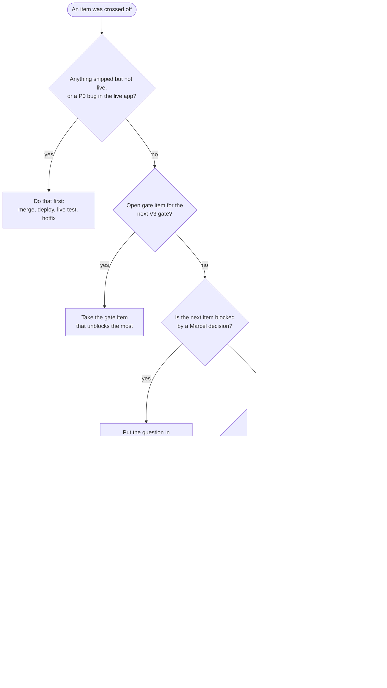

# 🍳 Koch — Roadmap index

> Start here. This page says **what is next** and where everything else lives.
> **Last updated: 2026-10-04** (PR #8 merged) · Live: **v2.14**

## The two roadmaps

| File | Covers | Boundary |
|------|--------|----------|
| **[ROADMAP-V2.md](ROADMAP-V2.md)** | The **v2.x line**: features + the foundation V3 needs, until V3 launches and v2 becomes the fallback | Ships on today's address and architecture, carries over into V3 unchanged |
| **[ROADMAP-V3.md](ROADMAP-V3.md)** | The **V3 line**: v3.0 infrastructure release (domain, Play Store, clean-up, onboarding), then v3.1, v3.x, v3.5/v4, someday | Needs the new domain, the Play build or the clean-up, or Marcel scheduled it after v3.0 |

Background and reasoning for V3: [`docs/v3/`](docs/v3/README.md). New idea after the scope freeze
(31 Dec 2026)? → `ROADMAP-V3.md`, tagged v3.x.

---

## The road to V3 at a glance

| When | V2 line | V3 line |
|------|---------|---------|
| **Oct 2026** | ✅ v2.14 friends link live (4 Oct) · e2e tests · **v2.15** one sync core · two-account sharing proof | Decisions: D8, A10, C7, D9 |
| **Nov 2026** | **v2.16** AI housekeeping · **v2.17** find recipes faster · **v2.18** export/import | Long-lead: domain, Play account, 12 testers |
| **Dec 2026** | **v2.19** calories | Spikes (TWA, sign-in, photos, repo layout) · ADRs · V3 plan · **scope freeze 31 Dec** |
| **Jan–Mar 2027** | **v2.20** assistant edits recipes · **v2.21** move helper (before the domain switch) · v2.22+ small wins if time | **v3.0-a1 … a9** = slices 1–9 · closed test from slice 3 |
| **Apr 2027** | Fixes only | **v3.0 launch, target 30 Apr** |
| **May 2027** | 30-day read-only fallback | Buffer · **hard cutoff 31 May** → leftovers to v3.1 |
| **H2 2027** | Retired | v3.1 · v3.x (shared cookbook, spend display, longevity cards …) |

---

## ▶ Recommended next

The queue always holds the next **5** items across both lines, in order. Re-ranked with the flow
below every time an item is crossed off.

| # | Item | Line | Owner | Why now | Effort | Unblocks |
|---|------|------|-------|---------|--------|----------|
| 1 | **Live friend test** (V2 P4) — PR #8 merged 2026-10-04 | V2 | Marcel | v2.14 is live; the one backend piece should be proven with a real friend before D9 is written | 15 min | D9, closes I3 |
| 2 | **Two-account sharing proof** (V2 P3): Picker API key, partner as test user, run the test in `v2/docs/SHARING.md` | V2 | Marcel (Claude guides) | Gate item for V3 slice 1; open since v2.11 | ~45 min | V3 gate, US-06 |
| 3 | **End-to-end test suite** (V2 P2) | V2 | Claude | Gate item; must exist **before** the sync-core refactor so the refactor can't change behaviour unnoticed | L | P1, V3 slice 6 |
| 4 | **v2.15 — one sync core** (V2 P1) | V2 | Claude | Last gate item from the V2 side; shared weekly plan and shared cookbook later reuse it | L | V3 slice 1, slice 8 |
| 5 | **v2.16 — AI housekeeping** (V2 Q1–Q3) | V2 | Claude | Unblocked and small; capture still runs on an older model (risk R9); token data feeds the v3.x spend display | S | US-12 later |

**Waiting on Marcel — 5-minute answers that unblock the queue** (details in `ROADMAP-V3.md` §6):
**G7** recipe-finding picks → v2.17 · **L1** nutrition model → v2.19 · **E6** assistant may delete? → v2.20 ·
**D8 / L1** English as main language · **A10** shared plan · **C7** name + domain · **D9** keep Supabase in v3.0 → V3 plan.

---

## How the next item is chosen (recommendation flow)

**The rules behind it, in priority order**
1. **Live beats new.** Something built but not deployed or not verified on a real device comes first.
2. **Gates beat features.** Items that gate the next V3 gate (currently V2 P1–P3) come before anything else.
3. **Decisions are cheap, waiting is expensive.** A blocked item is never "next"; its question goes to Marcel instead, and the next unblocked item moves up.
4. **Core tier first.** Recipes + cooking mode, shopping list, AI capture and chat beat plan, stock and extras (usage tiers in `docs/v3/00-INTENT-AND-USER-STORIES.md`).
5. **Fits the week.** One release = one 2–3 h test session for Marcel. Split anything bigger.
6. **Dates win.** What can't make the scope freeze (31 Dec 2026) or the cutoff (31 May 2027) moves out, it doesn't stretch the date.

---

## Update rule — when an item is crossed off

Part of every release's definition of done (Claude Code does this; the release-captain agent checks it):

1. **Roadmap file:** mark the item ✅ with version + date. V2: move it to the shipped log. V3: set the status in its table.
2. **Version plan:** set that version's status to ✅; re-date later rows if something slipped.
3. **This page:** remove the item from **Recommended next**, run the flow, refill the queue to 5, update "Last updated" and the "at a glance" table if dates moved.
4. **docs/v3:** if the item closes a check (C-x) or story (US-x), tick it in `docs/v3/03-QUESTIONS.md`.
5. **Marcel answered a question:** record the answer in the roadmap row and in `docs/v3/03-QUESTIONS.md` Part 3, then unblock the dependent item.

---

## Other planning files

| File | What it is |
|------|------------|
| [`docs/v3/`](docs/v3/README.md) | V3 preparation package: intent, user stories, decisions D1–D8, questions, risks, learning track |
| [`v2/docs/SHARING.md`](v2/docs/SHARING.md) | How partner sharing and the friends link work + test steps |
| [`qa/FLEET-REPORT.md`](qa/FLEET-REPORT.md) | QA agent findings; promoted into a roadmap by hand |
| `.planning/ROADMAP.md` | Working file of the planning tool for the finished shared-list phase (v2.10). Not a product roadmap. |
| `SCHEMA.md` | The `rezepte.json` contract |